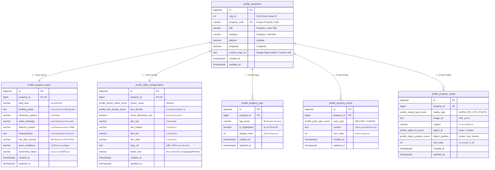

# PostgreSQL Database Schema for Property Pitch Studio

ระบบฐานข้อมูลสำหรับจัดเก็บข้อมูลอสังหาริมทรัพย์และตั้งค่าหน้าสไลด์ One-Pager (รองรับ PostgreSQL 12 ขึ้นไป)

---

## 1. Entity Relationship Overview

### ความสัมพันธ์ระหว่างตาราง (ER Diagram)



---

## 2. Custom Types & ENUMs

```sql
-- ลบ Type เดิมหากมีอยู่เพื่อป้องกัน Error ตอนรันซ้ำ
DROP TYPE IF EXISTS profile_point_type_enum CASCADE;
DROP TYPE IF EXISTS profile_media_type_enum CASCADE;
DROP TYPE IF EXISTS profile_object_fit_enum CASCADE;
DROP TYPE IF EXISTS profile_object_position_enum CASCADE;
DROP TYPE IF EXISTS profile_text_density_enum CASCADE;
DROP TYPE IF EXISTS profile_theme_name_enum CASCADE;

-- 1. ประเภทของจุดเน้น (จุดขาย SELLING หรือ ข้อควรระวัง/ข้อจำกัด CAVEAT)
CREATE TYPE profile_point_type_enum AS ENUM ('SELLING', 'CAVEAT');

-- 2. ประเภทสื่อรูปภาพ (ภาพถ่ายดาวเทียม SATELLITE หรือ ภาพถ่ายสภาพพื้นที่ SITE_PHOTO)
CREATE TYPE profile_media_type_enum AS ENUM ('SATELLITE', 'SITE_PHOTO');

-- 3. การปรับสัดส่วนภาพ (CSS Object Fit)
CREATE TYPE profile_object_fit_enum AS ENUM ('cover', 'contain');

-- 4. ตำแหน่งโฟกัสภาพ (CSS Object Position)
CREATE TYPE profile_object_position_enum AS ENUM ('center', 'top', 'bottom');

-- 5. ความหนาแน่นของข้อความบนหน้าสไลด์
CREATE TYPE profile_text_density_enum AS ENUM ('normal', 'compact', 'ultracompact');

-- 6. ธีมสีหลักของหน้าสไลด์
CREATE TYPE profile_theme_name_enum AS ENUM ('corporate-yellow', 'modern-navy', 'emerald-green', 'luxury-red');
```

---

## 3. Table Creation (DDL)

```sql
-- ลบตารางเดิมตามลำดับ Dependency หากต้องการเริ่มสร้างใหม่
DROP TABLE IF EXISTS profile_slide_configurations CASCADE;
DROP TABLE IF EXISTS profile_property_media CASCADE;
DROP TABLE IF EXISTS profile_property_points CASCADE;
DROP TABLE IF EXISTS profile_property_tags CASCADE;
DROP TABLE IF EXISTS profile_property_specs CASCADE;
DROP TABLE IF EXISTS profile_properties CASCADE;

-- -------------------------------------------------------------
-- 1. ตารางหลักข้อมูลอสังหาริมทรัพย์ (Properties)
-- -------------------------------------------------------------
CREATE TABLE profile_properties (
    id BIGSERIAL PRIMARY KEY,
    cdg_id INT NOT NULL DEFAULT 0,
    property_code VARCHAR(50) NOT NULL UNIQUE,
    title VARCHAR(255) NOT NULL,
    category VARCHAR(100) NOT NULL DEFAULT 'ชื่อผืนที่ / PROPERTY',
    latitude DECIMAL(10, 7) NOT NULL,
    longitude DECIMAL(10, 7) NOT NULL,
    custom_map_url TEXT,
    created_at TIMESTAMPTZ NOT NULL DEFAULT CURRENT_TIMESTAMP,
    updated_at TIMESTAMPTZ NOT NULL DEFAULT CURRENT_TIMESTAMP
);

COMMENT ON TABLE profile_properties IS 'ตารางหลักเก็บข้อมูลโครงการและพิกัดที่ตั้ง';
COMMENT ON COLUMN profile_properties.id IS 'Primary Key รหัสประจำทรัพย์สิน';
COMMENT ON COLUMN profile_properties.cdg_id IS 'รหัสอ้างอิงพื้นที่ CDG (1 cdg_id สามารถมีหลาย property_code)';
COMMENT ON COLUMN profile_properties.property_code IS 'รหัสอ้างอิงทรัพย์สิน (Unique Code)';
COMMENT ON COLUMN profile_properties.title IS 'ชื่อโครงการ / แปลงที่ดิน';
COMMENT ON COLUMN profile_properties.category IS 'หมวดหมู่ / Sub-title ของแปลงที่ดิน';
COMMENT ON COLUMN profile_properties.latitude IS 'พิกัดละติจูด (Latitude)';
COMMENT ON COLUMN profile_properties.longitude IS 'พิกัดลองจิจูด (Longitude)';
COMMENT ON COLUMN profile_properties.custom_map_url IS 'URL แผนที่แบบกำหนดเอง หรือ Google Maps Embed URL';
COMMENT ON COLUMN profile_properties.created_at IS 'วันเวลาที่สร้างข้อมูล';
COMMENT ON COLUMN profile_properties.updated_at IS 'วันเวลาที่แก้ไขข้อมูลล่าสุด';

-- -------------------------------------------------------------
-- 2. ตารางสเปกพื้นที่ 9 รายการ (Property Specifications - 1:1)
-- -------------------------------------------------------------
CREATE TABLE profile_property_specs (
    id BIGSERIAL PRIMARY KEY,
    property_id BIGINT NOT NULL UNIQUE REFERENCES profile_properties(id) ON DELETE CASCADE,
    land_area VARCHAR(100) NOT NULL,
    building_detail TEXT NOT NULL,
    electricity_system VARCHAR(255) NOT NULL,
    water_drainage VARCHAR(255) NOT NULL,
    telecom_system VARCHAR(255) NOT NULL,
    transportation TEXT NOT NULL,
    city_plan_zoning VARCHAR(100) NOT NULL,
    price_conditions VARCHAR(255) NOT NULL,
    ownership_status VARCHAR(255) NOT NULL,
    created_at TIMESTAMPTZ NOT NULL DEFAULT CURRENT_TIMESTAMP,
    updated_at TIMESTAMPTZ NOT NULL DEFAULT CURRENT_TIMESTAMP
);

COMMENT ON TABLE profile_property_specs IS 'รายละเอียดสเปกพื้นที่ 9 หมวดตามหน้า One-Pager (ความสัมพันธ์ 1:1)';
COMMENT ON COLUMN profile_property_specs.id IS 'Primary Key รหัสสเปกพื้นที่';
COMMENT ON COLUMN profile_property_specs.property_id IS 'Foreign Key อ้างอิง profile_properties.id';
COMMENT ON COLUMN profile_property_specs.land_area IS '1. ขนาดพื้นที่ดิน (เช่น 2-2-77.00 ไร่)';
COMMENT ON COLUMN profile_property_specs.building_detail IS '2. รายละเอียดอาคารและสิ่งปลูกสร้าง';
COMMENT ON COLUMN profile_property_specs.electricity_system IS '3. ระบบไฟฟ้าและกำลังไฟ';
COMMENT ON COLUMN profile_property_specs.water_drainage IS '4. ระบบประปาและสุขาภิบาล/ระบายน้ำ';
COMMENT ON COLUMN profile_property_specs.telecom_system IS '5. ระบบโทรคมนาคมและเส้นทางใยแก้วนำแสง (Fiber)';
COMMENT ON COLUMN profile_property_specs.transportation IS '6. การคมนาคม การเข้าถึง และระยะทางจากจุดสำคัญ';
COMMENT ON COLUMN profile_property_specs.city_plan_zoning IS '7. สีผังเมืองและการใช้ประโยชน์ที่ดิน';
COMMENT ON COLUMN profile_property_specs.price_conditions IS '8. เงื่อนไขราคา อัตราเช่า หรือข้อเสนอการลงทุน';
COMMENT ON COLUMN profile_property_specs.ownership_status IS '9. สถานะกรรมสิทธิ์ เอกสารสิทธิ์ หรือเลขที่โฉนด';
COMMENT ON COLUMN profile_property_specs.created_at IS 'วันเวลาที่สร้างข้อมูล';
COMMENT ON COLUMN profile_property_specs.updated_at IS 'วันเวลาที่แก้ไขข้อมูลล่าสุด';

-- -------------------------------------------------------------
-- 3. ตารางกลุ่มธุรกิจเป้าหมาย (Target Business Tags - 1:N)
-- -------------------------------------------------------------
CREATE TABLE profile_property_tags (
    id BIGSERIAL PRIMARY KEY,
    property_id BIGINT NOT NULL REFERENCES profile_properties(id) ON DELETE CASCADE,
    tag_name VARCHAR(100) NOT NULL,
    is_highlighted BOOLEAN NOT NULL DEFAULT FALSE,
    display_order INT NOT NULL DEFAULT 0,
    created_at TIMESTAMPTZ NOT NULL DEFAULT CURRENT_TIMESTAMP,
    updated_at TIMESTAMPTZ NOT NULL DEFAULT CURRENT_TIMESTAMP
);

COMMENT ON TABLE profile_property_tags IS 'แท็กกลุ่มธุรกิจเป้าหมาย (Target Business) พร้อมสถานะไฮไลต์';
COMMENT ON COLUMN profile_property_tags.id IS 'Primary Key รหัสแท็ก';
COMMENT ON COLUMN profile_property_tags.property_id IS 'Foreign Key อ้างอิง profile_properties.id';
COMMENT ON COLUMN profile_property_tags.tag_name IS 'ชื่อกลุ่มธุรกิจเป้าหมาย (เช่น Data center, Office)';
COMMENT ON COLUMN profile_property_tags.is_highlighted IS 'สถานะไฮไลต์ (TRUE = ไฮไลต์สีทึบ/ติ๊กถูก, FALSE = กรอบธรรมดา)';
COMMENT ON COLUMN profile_property_tags.display_order IS 'ลำดับการแสดงผลแท็ก (น้อยไปมาก)';
COMMENT ON COLUMN profile_property_tags.created_at IS 'วันเวลาที่สร้างข้อมูล';
COMMENT ON COLUMN profile_property_tags.updated_at IS 'วันเวลาที่แก้ไขข้อมูลล่าสุด';

-- -------------------------------------------------------------
-- 4. ตารางจุดขายและข้อควรระวัง (Selling Points & Caveats - 1:N)
-- -------------------------------------------------------------
CREATE TABLE profile_property_points (
    id BIGSERIAL PRIMARY KEY,
    property_id BIGINT NOT NULL REFERENCES profile_properties(id) ON DELETE CASCADE,
    point_type profile_point_type_enum NOT NULL,
    content TEXT NOT NULL,
    sort_order INT NOT NULL DEFAULT 0,
    created_at TIMESTAMPTZ NOT NULL DEFAULT CURRENT_TIMESTAMP,
    updated_at TIMESTAMPTZ NOT NULL DEFAULT CURRENT_TIMESTAMP
);

COMMENT ON TABLE profile_property_points IS 'รายการจุดขาย (SELLING) และข้อควรระวัง/ข้อจำกัด (CAVEAT)';
COMMENT ON COLUMN profile_property_points.id IS 'Primary Key รหัสจุดเน้น';
COMMENT ON COLUMN profile_property_points.property_id IS 'Foreign Key อ้างอิง profile_properties.id';
COMMENT ON COLUMN profile_property_points.point_type IS 'ประเภทจุดเน้น (SELLING หรือ CAVEAT)';
COMMENT ON COLUMN profile_property_points.content IS 'ข้อความอธิบายจุดเด่นหรือข้อจำกัด';
COMMENT ON COLUMN profile_property_points.sort_order IS 'ลำดับการแสดงผล (น้อยไปมาก)';
COMMENT ON COLUMN profile_property_points.created_at IS 'วันเวลาที่สร้างข้อมูล';
COMMENT ON COLUMN profile_property_points.updated_at IS 'วันเวลาที่แก้ไขข้อมูลล่าสุด';

-- -------------------------------------------------------------
-- 5. ตารางรูปภาพและสื่อประกอบ (Media & Site Photos - 1:N)
-- -------------------------------------------------------------
CREATE TABLE profile_property_media (
    id BIGSERIAL PRIMARY KEY,
    property_id BIGINT NOT NULL REFERENCES profile_properties(id) ON DELETE CASCADE,
    media_type profile_media_type_enum NOT NULL,
    image_url TEXT NOT NULL,
    caption VARCHAR(100),
    object_fit profile_object_fit_enum NOT NULL DEFAULT 'cover',
    object_position profile_object_position_enum NOT NULL DEFAULT 'center',
    slot_index INT NOT NULL DEFAULT 1,
    created_at TIMESTAMPTZ NOT NULL DEFAULT CURRENT_TIMESTAMP,
    updated_at TIMESTAMPTZ NOT NULL DEFAULT CURRENT_TIMESTAMP
);

COMMENT ON TABLE profile_property_media IS 'ภาพถ่ายดาวเทียมและภาพสภาพพื้นที่ 3 จุด';
COMMENT ON COLUMN profile_property_media.id IS 'Primary Key รหัสสื่อรูปภาพ';
COMMENT ON COLUMN profile_property_media.property_id IS 'Foreign Key อ้างอิง profile_properties.id';
COMMENT ON COLUMN profile_property_media.media_type IS 'ประเภทสื่อ (SATELLITE หรือ SITE_PHOTO)';
COMMENT ON COLUMN profile_property_media.image_url IS 'URL ตำแหน่งจัดเก็บรูปภาพ';
COMMENT ON COLUMN profile_property_media.caption IS 'คำบรรยายสั้นใต้ภาพ';
COMMENT ON COLUMN profile_property_media.object_fit IS 'การจัดสัดส่วนภาพ (cover, contain)';
COMMENT ON COLUMN profile_property_media.object_position IS 'ตำแหน่งจุดกึ่งกลางภาพ (center, top, bottom)';
COMMENT ON COLUMN profile_property_media.slot_index IS 'ตำแหน่งช่องภาพ (1, 2, 3)';
COMMENT ON COLUMN profile_property_media.created_at IS 'วันเวลาที่สร้างข้อมูล';
COMMENT ON COLUMN profile_property_media.updated_at IS 'วันเวลาที่แก้ไขข้อมูลล่าสุด';

-- -------------------------------------------------------------
-- 6. ตารางการตั้งค่าหน้าสไลด์และเลย์เอาต์ (Slide Configurations - 1:1)
-- -------------------------------------------------------------
CREATE TABLE profile_slide_configurations (
    id BIGSERIAL PRIMARY KEY,
    property_id BIGINT NOT NULL UNIQUE REFERENCES profile_properties(id) ON DELETE CASCADE,
    theme_name profile_theme_name_enum NOT NULL DEFAULT 'corporate-yellow',
    text_density profile_text_density_enum NOT NULL DEFAULT 'normal',
    show_dimension_box BOOLEAN NOT NULL DEFAULT TRUE,
    dim_top VARCHAR(50) DEFAULT 'หน้ากว้าง 34 ม.',
    dim_bottom VARCHAR(50) DEFAULT 'กว้างหลัง 34 ม.',
    dim_left VARCHAR(50) DEFAULT 'ลึก 100 ม.',
    dim_right VARCHAR(50) DEFAULT 'ลึก 100 ม.',
    logo_url TEXT,
    footer_text VARCHAR(255) NOT NULL DEFAULT '© National Telecom All Rights Reserved',
    created_at TIMESTAMPTZ NOT NULL DEFAULT CURRENT_TIMESTAMP,
    updated_at TIMESTAMPTZ NOT NULL DEFAULT CURRENT_TIMESTAMP
);

COMMENT ON TABLE profile_slide_configurations IS 'การตั้งค่าสไตล์ ขนาดอักษร เส้นวัดระยะ และ Footer ของสไลด์ (ความสัมพันธ์ 1:1)';
COMMENT ON COLUMN profile_slide_configurations.id IS 'Primary Key รหัสการตั้งค่าสไลด์';
COMMENT ON COLUMN profile_slide_configurations.property_id IS 'Foreign Key อ้างอิง profile_properties.id (1:1)';
COMMENT ON COLUMN profile_slide_configurations.theme_name IS 'ธีมสีของหน้าสไลด์';
COMMENT ON COLUMN profile_slide_configurations.text_density IS 'ความหนาแน่นข้อความ (normal, compact, ultracompact)';
COMMENT ON COLUMN profile_slide_configurations.show_dimension_box IS 'สถานะแสดงกล่องวัดระยะขนาดที่ดิน';
COMMENT ON COLUMN profile_slide_configurations.dim_top IS 'ระยะวัดขนาดด้านบน';
COMMENT ON COLUMN profile_slide_configurations.dim_bottom IS 'ระยะวัดขนาดด้านล่าง';
COMMENT ON COLUMN profile_slide_configurations.dim_left IS 'ระยะวัดขนาดด้านซ้าย';
COMMENT ON COLUMN profile_slide_configurations.dim_right IS 'ระยะวัดขนาดด้านขวา';
COMMENT ON COLUMN profile_slide_configurations.logo_url IS 'URL รูปภาพโลโก้';
COMMENT ON COLUMN profile_slide_configurations.footer_text IS 'ข้อความแสดงท้ายสไลด์ (Footer text)';
COMMENT ON COLUMN profile_slide_configurations.created_at IS 'วันเวลาที่สร้างข้อมูล';
COMMENT ON COLUMN profile_slide_configurations.updated_at IS 'วันเวลาที่แก้ไขข้อมูลล่าสุด';
```

---

## 4. Indexes & Constraints

```sql
-- 1. Indexes สำหรับค้นหาและจัดกลุ่มใน profile_properties
CREATE INDEX idx_profile_properties_cdg_id ON profile_properties(cdg_id);
CREATE INDEX idx_profile_properties_title ON profile_properties(title);

-- 2. Indexes สำหรับตารางลูก (Foreign Keys & Composite Sorting)
CREATE INDEX idx_profile_property_tags_lookup ON profile_property_tags(property_id, display_order);
CREATE INDEX idx_profile_property_points_lookup ON profile_property_points(property_id, point_type, sort_order);
CREATE INDEX idx_profile_property_media_lookup ON profile_property_media(property_id, media_type, slot_index);

-- 3. Unique Index ป้องกัน slot_index ซ้ำในแต่ละประเภทสื่อของแต่ละทรัพย์สิน
CREATE UNIQUE INDEX uq_profile_property_media_slot 
ON profile_property_media(property_id, media_type, slot_index);
```

---

## 5. Triggers สำหรับอัปเดต `updated_at` อัตโนมัติ

```sql
-- ฟังก์ชันสำหรับอัปเดต timestamp
CREATE OR REPLACE FUNCTION update_timestamp_column()
RETURNS TRIGGER AS $$
BEGIN
    NEW.updated_at = CURRENT_TIMESTAMP;
    RETURN NEW;
END;
$$ LANGUAGE plpgsql;

-- สร้าง Trigger ให้ครบทุกตารางที่มีฟิลด์ updated_at
CREATE TRIGGER trg_update_profile_properties_timestamp
BEFORE UPDATE ON profile_properties
FOR EACH ROW EXECUTE FUNCTION update_timestamp_column();

CREATE TRIGGER trg_update_profile_property_specs_timestamp
BEFORE UPDATE ON profile_property_specs
FOR EACH ROW EXECUTE FUNCTION update_timestamp_column();

CREATE TRIGGER trg_update_profile_property_tags_timestamp
BEFORE UPDATE ON profile_property_tags
FOR EACH ROW EXECUTE FUNCTION update_timestamp_column();

CREATE TRIGGER trg_update_profile_property_points_timestamp
BEFORE UPDATE ON profile_property_points
FOR EACH ROW EXECUTE FUNCTION update_timestamp_column();

CREATE TRIGGER trg_update_profile_property_media_timestamp
BEFORE UPDATE ON profile_property_media
FOR EACH ROW EXECUTE FUNCTION update_timestamp_column();

CREATE TRIGGER trg_update_profile_slide_configurations_timestamp
BEFORE UPDATE ON profile_slide_configurations
FOR EACH ROW EXECUTE FUNCTION update_timestamp_column();
```

---

## 6. Seed / Mock Data (ตัวอย่างข้อมูลจากสไลด์ "ชุมสายพระโขนง")

```sql
DO $$
DECLARE
    v_property_id BIGINT;
BEGIN
    -- 1. Insert Property
    INSERT INTO profile_properties (
        property_code, cdg_id, title, category, latitude, longitude, custom_map_url
    ) VALUES (
        'NT-PKN-001',
        101,
        'ชุมสายพระโขนง',
        'ชื่อผืนที่ / PROPERTY',
        13.707841,
        100.601377,
        'https://maps.google.com/?q=13.707841,100.601377'
    )
    RETURNING id INTO v_property_id;

    -- 2. Insert Specs (1:1)
    INSERT INTO profile_property_specs (
        property_id, land_area, building_detail, electricity_system, water_drainage,
        telecom_system, transportation, city_plan_zoning, price_conditions, ownership_status
    ) VALUES (
        v_property_id,
        '2-2-77.00 ไร่',
        'อาคาร คสล. เก่า (3ชั้น) พื้นที่รวม 2,270 ตรม. ว่างทั้งหลัง • อาคารชุมสายใหม่ 7 ชั้น พื้นที่รวม 6,780.88 ตรม. ว่าง ชั้น 4 พื้นที่ 925.5 ตรม. • รับ นน. 400-1,500 กก./ตรม.',
        'ระบบสายส่งผ่านหน้าที่ดิน 24 KV รองรับโหลดขนาดใหญ่',
        'การประปานครหลวง • ปลอดน้ำท่วม มีระบบระบายน้ำล้อมรอบ',
        'Fiber NT ถึงอาคาร • Carrier-neutral 2 เส้นทางหลัก',
        '200 ม. จากสถานีรถไฟฟ้าอ่อนนุช • 350 ม. จากจุดขึ้นลงทางพิเศษฉลองรัช • 1.5 กม. จากจุดขึ้นลงทางพิเศษเฉลิมมหานคร',
        'สีแดง (พาณิชยกรรม)',
        'อยู่ระหว่างการประเมินราคา / เปิดรับข้อเสนอร่วมลงทุน',
        'ทรัพย์สิน NT เลขที่โฉนด 8556 (พร้อมส่งมอบ)'
    );

    -- 3. Insert Target Business Tags (1:N)
    INSERT INTO profile_property_tags (property_id, tag_name, is_highlighted, display_order) VALUES
    (v_property_id, 'Potential location', TRUE, 1),
    (v_property_id, 'Data center potential', TRUE, 2),
    (v_property_id, 'Office', FALSE, 3),
    (v_property_id, 'Other', FALSE, 4);

    -- 4. Insert Selling Points & Caveats (1:N)
    INSERT INTO profile_property_points (property_id, point_type, content, sort_order) VALUES
    (v_property_id, 'SELLING', 'ระยะห่างจาก BTS อ่อนนุชเพียง 200 เมตร อยู่ในระยะเดินเท้าที่สะดวกมาก', 1),
    (v_property_id, 'SELLING', 'ใกล้ทางด่วน 2 สายหลัก (ฉลองรัช และเฉลิมมหานคร) ทำให้เชื่อมต่อเข้าศูนย์กลางเมืองหรือออกนอกเมืองได้ง่าย', 2),
    (v_property_id, 'SELLING', 'พร้อมใช้เป็น Data Center หรือพื้นที่ติดตั้งเครื่องจักร/อุปกรณ์น้ำหนักมากโดยไม่ต้องเสริมโครงสร้างใหม่', 3),
    (v_property_id, 'CAVEAT', 'รูปทรงแปลงที่ดินแบบหน้าแคบ-ลึก', 1),
    (v_property_id, 'CAVEAT', 'การเข้าออกช่วงชั่วโมงเร่งด่วนอาจมีการจราจรหนาแน่นบริเวณถนนสุขุมวิท', 2);

    -- 5. Insert Media (1:N)
    INSERT INTO profile_property_media (
        property_id, media_type, image_url, caption, object_fit, object_position, slot_index
    ) VALUES
    (v_property_id, 'SATELLITE', 'https://images.unsplash.com/photo-1524661135-423995f22d0b', 'แผนที่ตั้ง (Satellite View)', 'cover', 'center', 1),
    (v_property_id, 'SITE_PHOTO', 'https://images.unsplash.com/photo-1577495508048-b635879837f1', 'สภาพที่ดิน', 'cover', 'center', 1),
    (v_property_id, 'SITE_PHOTO', 'https://images.unsplash.com/photo-1486406146926-c627a92ad1ab', 'สภาพแวดล้อม', 'cover', 'center', 2),
    (v_property_id, 'SITE_PHOTO', 'https://images.unsplash.com/photo-1545324418-cc1a3fa10c00', 'ทางเข้า-ออกโครงการ', 'cover', 'center', 3);

    -- 6. Insert Slide Configuration (1:1)
    INSERT INTO profile_slide_configurations (
        property_id, theme_name, text_density, show_dimension_box,
        dim_top, dim_bottom, dim_left, dim_right, logo_url, footer_text
    ) VALUES (
        v_property_id,
        'corporate-yellow',
        'normal',
        TRUE,
        'หน้ากว้าง 34 ม.',
        'กว้างหลัง 34 ม.',
        'ลึก 100 ม.',
        'ลึก 100 ม.',
        'https://example.com/logo.png',
        '© National Telecom All Rights Reserved'
    );
END $$;
```
