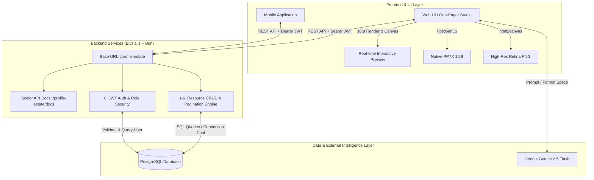

# Property Pitch Studio - ระบบสร้างสไลด์อสังหาริมทรัพย์ One-Pager ระดับมืออาชีพ

เอกสารข้อกำหนดเชิงเทคนิคและคู่มือสถาปัตยกรรมระบบ (Technical Specification & System Architecture Documentation) สำหรับ **Property Pitch Studio** เครื่องมือสร้างเอกสารและสไลด์สรุปข้อมูลอสังหาริมทรัพย์แปลงที่ดินและอาคาร (Property Profile / One-Pager Pitch) สัดส่วน 16:9 มาตรฐาน พร้อมระบบ Backend RESTful API ครบวงจรบน **Elysia.js + Bun Runtime**, ฐานข้อมูล **PostgreSQL**, ระบบยืนยันตัวตน **JWT Authentication** และระบบ AI จัด Layout อัจฉริยะ

อ้างอิงจากโครงสร้างอินเทอร์เฟซใน [profile_property.html](file:///Users/youtapong/tong_work/app_elysia/profile-estate/docs/profile_property.html) และฐานข้อมูล [database.md](file:///Users/youtapong/tong_work/app_elysia/profile-estate/docs/database.md)

---

## 1. ภาพรวมของระบบ (System Overview)

**Property Pitch Studio (Pro Edition)** ได้รับการออกแบบขึ้นเพื่อจัดการและนำเสนอข้อมูลอสังหาริมทรัพย์ของ National Telecom (NT) ในรูปแบบ One-Pager Pitch Deck สัดส่วน 16:9 ได้อย่างสมบูรณ์แบบ รองรับทั้งการแสดงผลผ่านเว็บ, โมบายล์แอปพลิเคชัน และการเชื่อมต่อผ่าน RESTful API



### จุดเด่นสำคัญของระบบ

- **สัดส่วน 16:9 Widescreen มาตรฐาน:** แสดงผลสวยงาม ไม่ตกขอบ รองรับหน้าจอคอมพิวเตอร์ โปรเจกเตอร์ และพิมพ์แบบ One-Pager
- **Backend ประสิทธิภาพสูง:** ขับเคลื่อนด้วย **Elysia.js** บน **Bun Runtime** รองรับ Type-Safety เต็มรูปแบบด้วย TypeBox Schema
- **ระบบจัดกลุ่ม API แบบเป็นระบบ:** จัดเรียงหมวดหมู่ API 0-6 อย่างชัดเจน พร้อมเอกสาร Interactive API Docs บน **Scalar** (`/profile-estate/docs`)
- **ระบบยืนยันตัวตน JWT:** ตรวจสอบสิทธิ์กับตาราง `user` ใน PostgreSQL พร้อมรองรับ Bearer Token และ Shortcut endpoint `/me`
- **ระบบแบ่งหน้า (Pagination):** รองรับ Query `page` และ `limit` พร้อมคำนวณ `total_pages`, `has_next`, `has_prev` สำหรับ Mobile App
- **จัด Layout อัจฉริยะ (Smart Auto-Fit & Density Control):** สลับโหมดความหนาแน่นข้อความ (Normal, Compact, Ultra-compact) ป้องกันการ์ดล้นจอ
- **ส่งออกไฟล์อเนกประสงค์:** ส่งออกเป็นไฟล์ Native PowerPoint (`.pptx`) แก้ไขข้อความต่อได้ และบันทึกรูปภาพความละเอียดสูง (`.png`) 2.5x Retina

---

## 2. โครงสร้างโปรเจกต์ (Project Structure)

```
profile-estate/
├── docs/                               # เอกสารข้อกำหนดและหน้าเว็บต้นแบบ
│   ├── database.md                     # DDL, ER Diagram, และ Data Dictionary ของ PostgreSQL
│   ├── profile_property.html           # ส่วนติดต่อผู้ใช้ต้นแบบ (Interactive 16:9 UI)
│   └── profile_property.md             # เอกสารสถาปัตยกรรมและข้อกำหนดระบบ (เอกสารนี้)
├── scripts/
│   └── migrate.ts                      # สคริปต์สร้าง Schema, Tables, Trigger และ Mock Data
├── src/
│   ├── index.ts                        # จุดเริ่มต้นเซิร์ฟเวอร์ Elysia, Scalar Swagger, Base Routing
│   ├── db.ts                           # การเชื่อมต่อ PostgreSQL Connection Pool
│   ├── models/                         # Data Models และ TypeBox Validation Schemas
│   │   ├── auth.model.ts               # Schema สำหรับ Login, Token Payload, User Profile
│   │   ├── common.model.ts             # Pagination Schema, Response Wrapper
│   │   ├── property.model.ts           # Schema ข้อมูลโครงการ (profile_properties)
│   │   ├── spec.model.ts               # Schema สเปกพื้นที่ 9 หมวด (profile_property_specs)
│   │   ├── tag.model.ts                # Schema กลุ่มธุรกิจเป้าหมาย (profile_property_tags)
│   │   ├── point.model.ts              # Schema จุดขายและข้อจำกัด (profile_property_points)
│   │   ├── media.model.ts              # Schema รูปภาพและสื่อ (profile_property_media)
│   │   └── slide-config.model.ts       # Schema การตั้งค่าหน้าสไลด์ (profile_slide_configurations)
│   └── routes/                         # RESTful API Endpoints
│       ├── auth.route.ts               # 0. Auth (Login, /auth/me, /me)
│       ├── property.route.ts           # 1. Properties (CRUD, cdg_id search, Full Details)
│       ├── spec.route.ts               # 2. Property Specs (CRUD, by property_id)
│       ├── tag.route.ts                # 3. Property Tags (CRUD, Batch save)
│       ├── point.route.ts              # 4. Property Points (CRUD, Batch save)
│       ├── media.route.ts              # 5. Property Media (CRUD, Batch save)
│       └── slide-config.route.ts       # 6. Slide Configurations (CRUD, by property_id)
├── Dockerfile                          # Docker Container build configuration
├── docker-compose.yml                  # Docker Compose สำหรับรันบน Production Server
├── package.json                        # รายการ Dependencies และคำสั่งสคริปต์
├── tsconfig.json                       # การตั้งค่า TypeScript
└── Tong_Readme.txt                     # บันทึกคำสั่งและ Deployment Checklist
```

---

## 3. สถาปัตยกรรมเลย์เอาต์ 16:9 (Layout & UI Architecture)

หน้าสไลด์ถูกวางตำแหน่งบน Responsive Grid System สัดส่วน 16:9 แบ่งพื้นที่เป็น 3 ส่วนหลัก:

```
+---------------------------------------------------------------------------------------------------+
| [Accent Bar]  CATEGORY / PROPERTY SUBTITLE                       TARGET BUSINESS                  |
|               Property Title (ชื่อโครงการ/แปลงที่ดิน)            [Tag 1 ★] [Tag 2 ★] [Tag 3] ...   |
+-------------------------------------------------+-------------------------------------------------+
| << LEFT COLUMN (5/12 Cols) >>                   | << RIGHT COLUMN (7/12 Cols) >>                  |
| +---------------------------------------------+ | [Icon] ข้อมูลพื้นที่ (Property Profile)         |
| | Satellite Map + Boundary Dimension Tags     | | +---------------------------------------------+ |
| | (ภาพดาวเทียม + ตัวเลขระยะ 4 ทิศ + พิกัด)    | | | 1. ขนาดพื้นที่: 2-2-77.00 ไร่              | |
| +---------------------------------------------+ | | 2. อาคาร: อาคาร คสล. 3 ชั้น...               | |
| +---------------------------------------------+ | | 3. ไฟฟ้า: ระบบสายส่ง 24 KV...               | |
| | Site Photo 1 | Site Photo 2 | Site Photo 3 | | | 4. ประปา / น้ำท่วม: การประปานครหลวง...      | |
| | [สภาพที่ดิน]   | [สภาพแวดล้อม] | [ทางเข้า-ออก] | | | 5. โทรคมนาคม: Fiber NT ถึงอาคาร...         | |
| +---------------------------------------------+ | | 6. คมนาคม: 200 ม. จาก BTS อ่อนนุช...        | |
| +---------------------------------------------+ | | 7. สีผังเมือง: สีแดง (พาณิชยกรรม)           | |
| | [GPS Bar] พิกัด + ลิงก์เปิด Google Maps     | | | 8. ราคา/อัตรา: เปิดรับข้อเสนอร่วมลงทุน...   | |
| +---------------------------------------------+ | | 9. กรรมสิทธิ์: ทรัพย์สิน NT โฉนด 8556...   | |
|                                                 | +---------------------------------------------+ |
|                                                 | +-----------------------+---------------------+ |
|                                                 | | ★ จุดขาย (Selling)   | ⚠ ข้อจำกัด (Caveats)| |
|                                                 | | • 200 ม. จาก BTS...   | • หน้าแคบ-ลึก...    | |
|                                                 | | • ใกล้ทางด่วน 2 สาย...| • จราจรหนาแน่น...   | |
|                                                 | +-----------------------+---------------------+ |
+-------------------------------------------------+-------------------------------------------------+
| [Corporate Logo: NT / Custom]                 © National Telecom All Rights Reserved [Accent Mark]|
+---------------------------------------------------------------------------------------------------+
```

---

## 4. โครงสร้าง RESTful API Endpoints (Base URL: `/profile-estate`)

ทุก Endpoint รองรับการส่งคำขอด้วย Content-Type `application/json` และมีการจัดกลุ่มเป็นระบบใน Scalar Documentation:

### 0. หมวด Authentication (`0. Auth`)

| Method | Path                         | การทำงาน                                               | Security     |
| :----- | :--------------------------- | :----------------------------------------------------- | :----------- |
| `POST` | `/profile-estate/auth/login` | เข้าสู่ระบบด้วย username & password เพื่อรับ JWT Token | Public       |
| `GET`  | `/profile-estate/auth/me`    | ตรวจสอบข้อมูลผู้ใช้งานปัจจุบันจาก JWT Token            | `BearerAuth` |
| `GET`  | `/profile-estate/me`         | Shortcut ดึงข้อมูลผู้ใช้งานปัจจุบัน                    | `BearerAuth` |

### 1. หมวดโครงการและแปลงที่ดิน (`1. Properties`)

| Method   | Path                                     | การทำงาน                                | พารามิเตอร์สำคัญ                                  |
| :------- | :--------------------------------------- | :-------------------------------------- | :------------------------------------------------ |
| `GET`    | `/profile-estate/properties`             | รายการโครงการทั้งหมด (พร้อม Pagination) | `page`, `limit`, `search`, `cdg_id`               |
| `GET`    | `/profile-estate/properties/:id`         | ดึงข้อมูลโครงการตาม Primary Key (`id`)  | `id` (Path)                                       |
| `GET`    | `/profile-estate/properties/cdg/:cdg_id` | ดึงรายการโครงการตามรหัสกลุ่มพื้นที่ CDG | `cdg_id` (Path), `page`, `limit`                  |
| `POST`   | `/profile-estate/properties`             | สร้างข้อมูลโครงการใหม่                  | `property_code`, `title`, `latitude`, `longitude` |
| `PATCH`  | `/profile-estate/properties/:id`         | แก้ไขข้อมูลโครงการ                      | `id` (Path), ข้อมูลที่ต้องการอัปเดต               |
| `DELETE` | `/profile-estate/properties/:id`         | ลบโครงการ (ลบข้อมูลตารางลูกแบบ CASCADE) | `id` (Path)                                       |

### 2. หมวดสเปกพื้นที่ 9 หมวด (`2. Property Specs`)

| Method   | Path                                          | การทำงาน                              |
| :------- | :-------------------------------------------- | :------------------------------------ |
| `GET`    | `/profile-estate/specs`                       | รายการสเปกพื้นที่ทั้งหมด (Pagination) |
| `GET`    | `/profile-estate/specs/:id`                   | ดึงข้อมูลสเปกตาม `id`                 |
| `GET`    | `/profile-estate/specs/property/:property_id` | ดึงข้อมูลสเปกตาม `property_id` (1:1)  |
| `POST`   | `/profile-estate/specs`                       | บันทึกสเปกพื้นที่ 9 หมวด              |
| `PATCH`  | `/profile-estate/specs/:id`                   | ปรับปรุงสเปกพื้นที่                   |
| `DELETE` | `/profile-estate/specs/:id`                   | ลบข้อมูลสเปก                          |

### 3. หมวดแท็กกลุ่มธุรกิจเป้าหมาย (`3. Property Tags`)

| Method   | Path                                               | การทำงาน                                            |
| :------- | :------------------------------------------------- | :-------------------------------------------------- |
| `GET`    | `/profile-estate/tags`                             | รายการแท็กทั้งหมด                                   |
| `GET`    | `/profile-estate/tags/:id`                         | ดึงแท็กตาม `id`                                     |
| `GET`    | `/profile-estate/tags/property/:property_id`       | ดึงแท็กทั้งหมดของโครงการ เรียงตาม `display_order`   |
| `POST`   | `/profile-estate/tags`                             | เพิ่มแท็กเดี่ยว                                     |
| `POST`   | `/profile-estate/tags/property/:property_id/batch` | บันทึกแท็กแบบชุด (Batch Sync) อัปเดตพร้อมกันทั้งชุด |
| `PATCH`  | `/profile-estate/tags/:id`                         | แก้ไขชื่อแท็กหรือสถานะไฮไลต์ (`is_highlighted`)     |
| `DELETE` | `/profile-estate/tags/:id`                         | ลบแท็ก                                              |

### 4. หมวดจุดขายและข้อควรระวัง (`4. Property Points`)

| Method   | Path                                                 | การทำงาน                                                |
| :------- | :--------------------------------------------------- | :------------------------------------------------------ |
| `GET`    | `/profile-estate/points`                             | รายการจุดขาย/ข้อจำกัดทั้งหมด                            |
| `GET`    | `/profile-estate/points/:id`                         | ดึงข้อมูลตาม `id`                                       |
| `GET`    | `/profile-estate/points/property/:property_id`       | ดึงจุดขาย (`SELLING`) และข้อจำกัด (`CAVEAT`) ของโครงการ |
| `POST`   | `/profile-estate/points`                             | เพิ่มรายการจุดเด่น/ข้อจำกัดเดี่ยว                       |
| `POST`   | `/profile-estate/points/property/:property_id/batch` | บันทึกจุดขาย/ข้อจำกัดแบบชุด (Batch Sync)                |
| `PATCH`  | `/profile-estate/points/:id`                         | แก้ไขเนื้อหาหรือประเภท                                  |
| `DELETE` | `/profile-estate/points/:id`                         | ลบรายการ                                                |

### 5. หมวดสื่อรูปภาพ (`5. Property Media`)

| Method   | Path                                                | การทำงาน                                            |
| :------- | :-------------------------------------------------- | :-------------------------------------------------- |
| `GET`    | `/profile-estate/media`                             | รายการสื่อรูปภาพทั้งหมด                             |
| `GET`    | `/profile-estate/media/:id`                         | ดึงสื่อตาม `id`                                     |
| `GET`    | `/profile-estate/media/property/:property_id`       | ดึงภาพดาวเทียมและภาพสภาพพื้นที่ 3 ช่อง              |
| `POST`   | `/profile-estate/media`                             | เพิ่มข้อมูลสื่อรูปภาพ                               |
| `POST`   | `/profile-estate/media/property/:property_id/batch` | บันทึกสื่อรูปภาพแบบชุด (Batch Sync)                 |
| `PATCH`  | `/profile-estate/media/:id`                         | ปรับปรุง URL, คำบรรยาย, object_fit, object_position |
| `DELETE` | `/profile-estate/media/:id`                         | ลบรูปภาพ                                            |

### 6. หมวดการตั้งค่าสไลด์ (`6. Slide Configurations`)

| Method   | Path                                                  | การทำงาน                                                 |
| :------- | :---------------------------------------------------- | :------------------------------------------------------- |
| `GET`    | `/profile-estate/slide-configs`                       | รายการการตั้งค่าทั้งหมด                                  |
| `GET`    | `/profile-estate/slide-configs/:id`                   | ดึงการตั้งค่าตาม `id`                                    |
| `GET`    | `/profile-estate/slide-configs/property/:property_id` | ดึงการตั้งค่าสไลด์ของโครงการ (1:1)                       |
| `POST`   | `/profile-estate/slide-configs`                       | บันทึกการตั้งค่าสไลด์ (Theme, Density, Dimensions, Logo) |
| `PATCH`  | `/profile-estate/slide-configs/:id`                   | ปรับปรุงการตั้งค่าสไลด์                                  |
| `DELETE` | `/profile-estate/slide-configs/:id`                   | ลบการตั้งค่า                                             |

---

## 5. การแมปข้อมูลระหว่าง UI, Backend API และ Database

| ส่วนประกอบบน UI (HTML/State) | ฟิลด์ใน API Payload                                                     | คอลัมน์ใน PostgreSQL                               | ตารางฐานข้อมูล                 |
| :--------------------------- | :---------------------------------------------------------------------- | :------------------------------------------------- | :----------------------------- |
| รหัสกลุ่มพื้นที่ CDG         | `cdg_id`                                                                | `cdg_id`                                           | `profile_properties`           |
| รหัสอ้างอิงทรัพย์สิน         | `property_code`                                                         | `property_code`                                    | `profile_properties`           |
| ชื่อโครงการ / แปลงที่ดิน     | `title`                                                                 | `title`                                            | `profile_properties`           |
| หมวดหมู่ / Sub-title         | `category`                                                              | `category`                                         | `profile_properties`           |
| ละติจูด / ลองจิจูด           | `latitude`, `longitude`                                                 | `latitude`, `longitude`                            | `profile_properties`           |
| ลิงก์ Google Maps            | `custom_map_url`                                                        | `custom_map_url`                                   | `profile_properties`           |
| 1. ขนาดพื้นที่ดิน            | `land_area`                                                             | `land_area`                                        | `profile_property_specs`       |
| 2. อาคารและสิ่งปลูกสร้าง     | `building_detail`                                                       | `building_detail`                                  | `profile_property_specs`       |
| 3. ระบบไฟฟ้า                 | `electricity_system`                                                    | `electricity_system`                               | `profile_property_specs`       |
| 4. ประปาและการระบายน้ำ       | `water_drainage`                                                        | `water_drainage`                                   | `profile_property_specs`       |
| 5. ระบบโทรคมนาคม/Fiber       | `telecom_system`                                                        | `telecom_system`                                   | `profile_property_specs`       |
| 6. การคมนาคมขนส่ง            | `transportation`                                                        | `transportation`                                   | `profile_property_specs`       |
| 7. สีผังเมือง                | `city_plan_zoning`                                                      | `city_plan_zoning`                                 | `profile_property_specs`       |
| 8. ราคา / เงื่อนไข           | `price_conditions`                                                      | `price_conditions`                                 | `profile_property_specs`       |
| 9. กรรมสิทธิ์ / โฉนด         | `ownership_status`                                                      | `ownership_status`                                 | `profile_property_specs`       |
| แท็กธุรกิจ & ไฮไลต์          | `tags: [{ tag_name, is_highlighted, display_order }]`                   | `tag_name`, `is_highlighted`, `display_order`      | `profile_property_tags`        |
| จุดขาย (Selling Points)      | `points: [{ point_type: 'SELLING', content, sort_order }]`              | `point_type`, `content`, `sort_order`              | `profile_property_points`      |
| ข้อจำกัด (Caveats)           | `points: [{ point_type: 'CAVEAT', content, sort_order }]`               | `point_type`, `content`, `sort_order`              | `profile_property_points`      |
| ภาพถ่ายดาวเทียม              | `media: [{ media_type: 'SATELLITE', image_url, ... }]`                  | `media_type`, `image_url`, `slot_index`            | `profile_property_media`       |
| ภาพสภาพพื้นที่ 3 ช่อง        | `media: [{ media_type: 'SITE_PHOTO', image_url, caption, slot_index }]` | `media_type`, `image_url`, `caption`, `slot_index` | `profile_property_media`       |
| ธีมสี (Theme)                | `theme_name`                                                            | `theme_name`                                       | `profile_slide_configurations` |
| ความหนาแน่นตัวอักษร          | `text_density`                                                          | `text_density`                                     | `profile_slide_configurations` |
| ระยะขอบเขต 4 ทิศ             | `dim_top`, `dim_bottom`, `dim_left`, `dim_right`                        | `dim_top`, `dim_bottom`, `dim_left`, `dim_right`   | `profile_slide_configurations` |
| โลโก้องค์กร                  | `logo_url`                                                              | `logo_url`                                         | `profile_slide_configurations` |
| ข้อความท้ายสไลด์             | `footer_text`                                                           | `footer_text`                                      | `profile_slide_configurations` |

---

## 6. โครงสร้างการตอบกลับข้อมูลมาตรฐาน (Standard Response Formats)

### 6.1 รูปแบบการตอบกลับรายการข้อมูลแบบแบ่งหน้า (Paginated List Response)

```json
{
  "success": true,
  "data": [
    {
      "id": 1,
      "cdg_id": 101,
      "property_code": "NT-PKN-001",
      "title": "ชุมสายพระโขนง",
      "category": "ที่ดินเพื่อการลงทุน / COMMERCIAL LAND",
      "latitude": "13.7078410",
      "longitude": "100.6013770",
      "custom_map_url": "https://maps.google.com/?q=13.707841,100.601377",
      "created_at": "2026-09-26T06:00:00.000Z",
      "updated_at": "2026-09-26T06:00:00.000Z"
    }
  ],
  "pagination": {
    "page": 1,
    "limit": 20,
    "total": 1,
    "total_pages": 1,
    "has_next": false,
    "has_prev": false
  }
}
```

### 6.2 รูปแบบการตอบกลับข้อมูลเดี่ยว (Single Resource Response)

```json
{
  "success": true,
  "message": "ดึงข้อมูลสำเร็จ",
  "data": {
    "id": 1,
    "property_code": "NT-PKN-001",
    "title": "ชุมสายพระโขนง"
  }
}
```

### 6.3 รูปแบบการตอบกลับเมื่อเกิดข้อผิดพลาด (Error Response)

```json
{
  "success": false,
  "message": "ไม่พบข้อมูลโครงการที่ระบุ (ID: 999)"
}
```

---

## 7. เทคโนโลยีและเครื่องมือที่ใช้งาน (Tech Stack)

### Backend API

- **Runtime:** [Bun](https://bun.sh/) (v1.3+)
- **Framework:** [Elysia.js](https://elysiajs.com/) (v1.2+)
- **Database Driver:** `postgres` (Postgres.js Connection Pool)
- **Authentication:** `@elysiajs/jwt` + `@elysiajs/bearer`
- **Documentation:** `@elysiajs/swagger` (Scalar UI Provider)
- **Validation:** TypeBox (`t` from Elysia)

### Database

- **Database Management System:** PostgreSQL 12+ (พร้อม Table Triggers, ENUMs, Indexes)

### Frontend & Export Tools

- **UI Framework:** HTML5 + Tailwind CSS + Google Fonts (Prompt & Sarabun)
- **Slide Generator:** PptxGenJS (Native 16:9 `.pptx`)
- **Image Renderer:** html2canvas (High-Res `.png`)
- **AI Engine:** Google Gemini API (`gemini-2.5-flash`)

---

## 8. การติดตั้ง รันระบบ และการ Deploy (Operations & Deployment)

### 8.1 การรัน Local Development

```bash
# 1. ติดตั้ง Dependencies
bun install

# 2. รัน Database Migration และเพิ่มข้อมูลเริ่มต้น
bun run db:migrate

# 3. รัน Server ในโหมด Development
bun run dev
```

- เข้าใช้งาน Scalar API Docs: [http://localhost:3000/profile-estate/docs](http://localhost:3000/profile-estate/docs)

### 8.2 การ Deploy บนเซิร์ฟเวอร์ด้วย Docker

```bash
# สั่ง Build และรัน Container ในพื้นหลัง
docker compose up -d --build

# ตรวจสอบสถานะและดู Logs
docker compose logs -f
```
